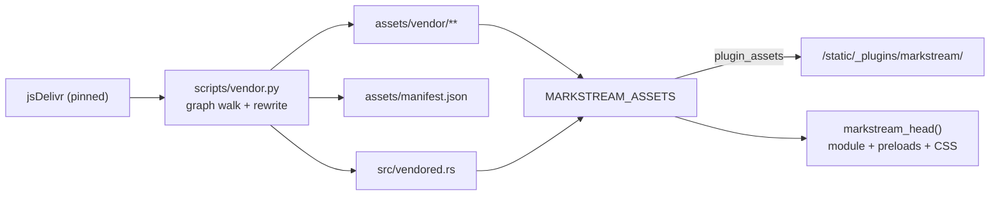

# ADR 0001: Vendor the ESM tree and rewrite bare imports

- Status: accepted
- Date: 2026-10-08
- Applies to: autumn-plugin-markstream 0.1.0, autumn-web 0.8.0

## Context

- markstream ships ESM only. It has no UMD or IIFE build.
- markstream-vue imports `vue`, `stream-markdown-parser` and
  `markstream-core` by bare specifier. A browser cannot resolve a bare
  specifier without an import map.
- An import map is an inline `<script type="importmap">`. The default
  Autumn CSP (`script-src 'self'`) blocks inline scripts.
- Autumn 0.8 serves plugin files through `PluginAssets` with hashed URLs,
  plain URLs and SRI hashes.

## Decision

- `scripts/vendor.py` downloads pinned files. It walks the module graph
  from `markstream-vue/dist/index.js`, so each lazy chunk is in the bundle.
- The script rewrites each bare import to a relative path. Optional peers
  (`katex`, `mermaid`, `stream-diffs`, `@terrastruct/d2`) stay bare.
  markstream catches the failed dynamic import and shows the source.
- Use the Vue runtime build. It has no `new Function`.
- The script writes `assets/manifest.json` (two SHA-384 pins for each file:
  upstream and served) and `src/vendored.rs` (bundle entries and eager
  modules).
- `markstream_head()` writes a `modulepreload` link with `integrity` for
  each eager module.

## Consequences

- No inline script. The plugin works with the default CSP and nonce mode.
- Tests guard the rewrite: each relative import resolves in the bundle,
  no required bare import remains, no `eval` exists.
- Relative imports resolve to plain URLs (`must-revalidate`, `ETag`).
  Only the init module and the two stylesheets use the `immutable`
  hashed URL.
- Lazy modules have no SRI check. They come from the same origin.
- A markstream upgrade changes chunk names. Run the script again.
